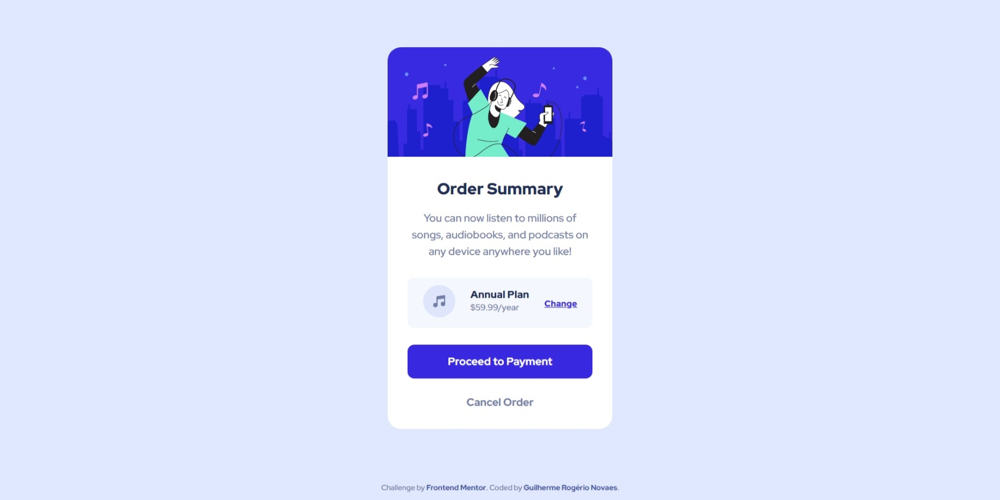
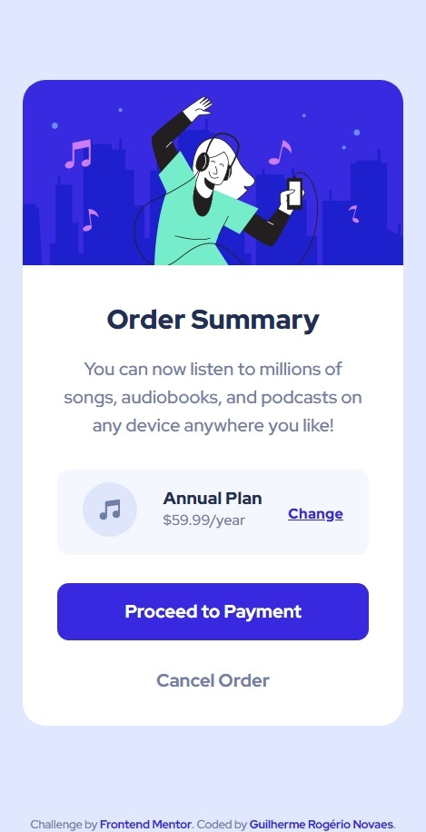

# Frontend Mentor - solução de NFT preview card

Esta é uma solução para o [desafio Order summary card no Frontend Mentor](https://www.frontendmentor.io/challenges/order-summary-component-QlPmajDUj).

## Índice

- [Visão geral](#visão-geral)
  - [Screenshot](#screenshot)
  - [Links](#links)
- [Meu processo](#meu-processo)
  - [Feito com](#feito-com)
  - [O que aprendi](#o-que-aprendi)
  - [Desenvolvimento contínuo](#Desenvolvimento-contínuo)
- [Autor](#autor)

## Visão geral

### Screenshot

### Links

- Visualização do site: [Visualizar](https://guilherme-rnovaes.github.io/order-summary-card/)

## Meu processo

### Feito com

- HTML5 semântico
- CSS3
- Flexbox

### O que aprendi

Aprendi mais sobre o HTML semântico e aprofundei muito mais meus conhecimentos no CSS e flexBox.

###  Desenvolvimento contínuo

Pretendo continuar estudando sobre HTML semântico e CSS com flexBox, estou muito satisfeito com o resultado, o que está me impulsionando ainda mais a continuar estudando e aprendendo.

## Autor

- Portfolio - [Guilherme Rogério Novaes](https://guilherme-rnovaes.github.io/Portfolio-Guilherme/)
- Frontend Mentor - [@Guilherme-RNovaes](https://www.frontendmentor.io/profile/Guilherme-RNovaes)